## Part 1 - Configurar el kernel

1. El primer que vaig fer va ser crear una VM de 200 GB amb les següents particions. És molt important que el swap sigui 20 GB, de forma que quan compilem el kernel tingui suficients recursos. El mateix passa amb el disc dur, per això és de 200 GB.     
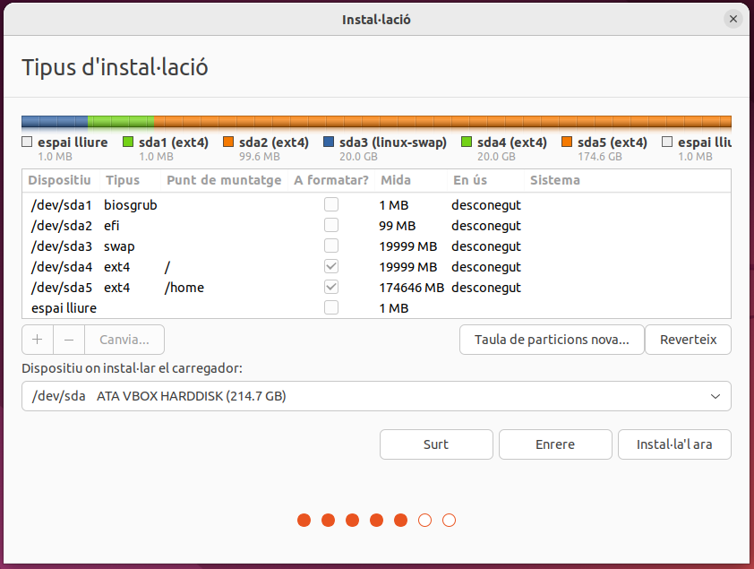

2. Seguidament, vaig verificar que la partició swap estigués activa utilitzant la comanda swapon --show.    
```bash
swapon --show
```
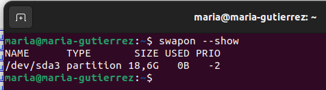

3. A continuació, vaig anar a la pàgina oficial del kernel de Linux (cdn.kernel.org) per descarregar el codi font. En concret, vaig seleccionar la versió linux-6.8.6.tar.gz. Un cop descarregat, amb la comanda ls dins de la carpeta ~/Baixades, vaig confirmar que l'arxiu s'havia descarregat correctament. Tot seguit, l'arxiu es va descomprimir i es va crear la carpeta linux-6.8.6.    
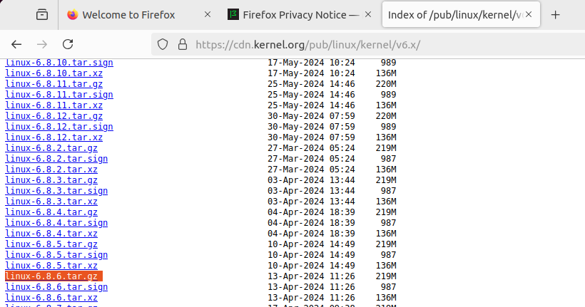
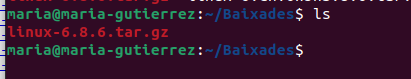
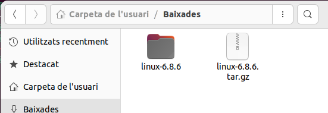

5. Després, vaig instal·lar els paquets i dependències essencials necessaris per a la compilació del kernel. La comanda sudo apt install -y build-essential libncurses-dev flex bison openssl libssl-dev dkms libelf-dev libudev-dev libpci-dev libiberty-dev autoconf dwarves instal·la eines com gcc, make, i les llibreries de desenvolupament (-dev) necessàries per al procés.      
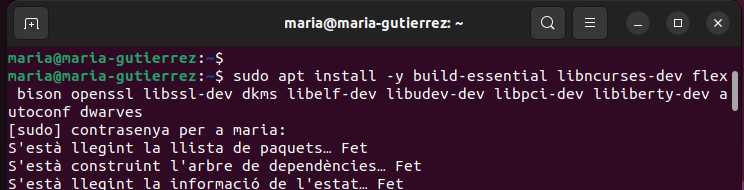
   
7. Com que el sistema podria haver estat instal·lat des d'un medi petit o netinst, vaig revisar l'arxiu /etc/apt/sources.list per afegir els repositoris main, restricted, universe, i multiverse. Després d'editar i guardar l'arxiu , vaig executar sudo apt update per actualitzar la llista de paquets disponibles.    
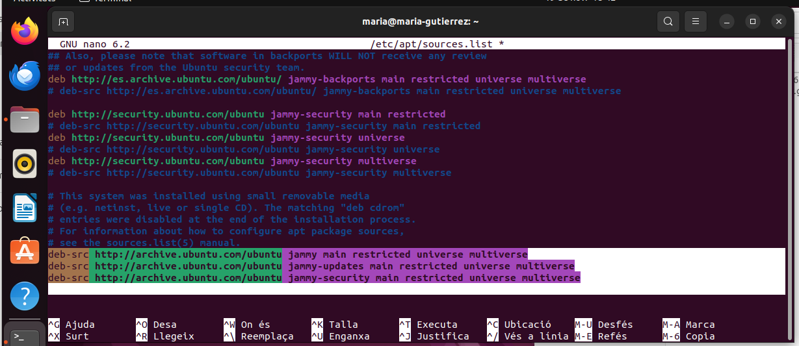


9. En un punt, vaig intentar instal·lar un paquet .deb amb sudo dpkg -i kernel-package_13.018+nmu2_all.deb , però va fallar a causa de problemes de dependències (li faltaven paquets com debconf, gettext i xmlto). Per solucionar-ho, vaig utilitzar la comanda sudo apt -f install, que força la instal·lació de dependències faltants. Després d'això, vaig poder instal·lar el paquet kernel-package correctament, tal com es mostra a la imatge.    
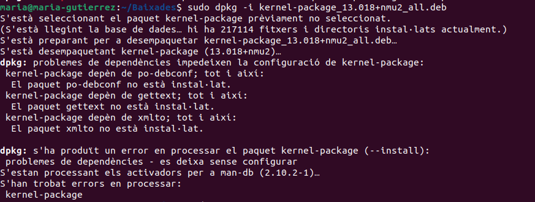
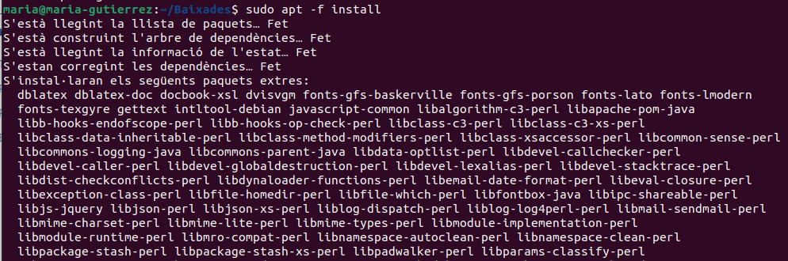
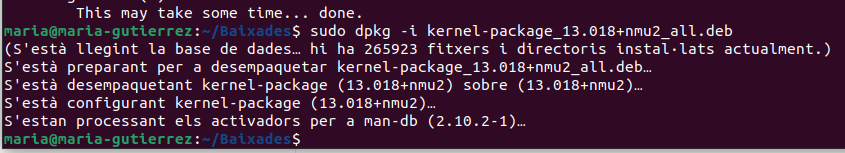

11. Finalment, vaig instal·lar altres paquets necessaris per a la construcció del kernel amb sudo apt build-dep linux , que instal·la les dependències de construcció del kernel de la distribució, i vaig acceptar la instal·lació.      
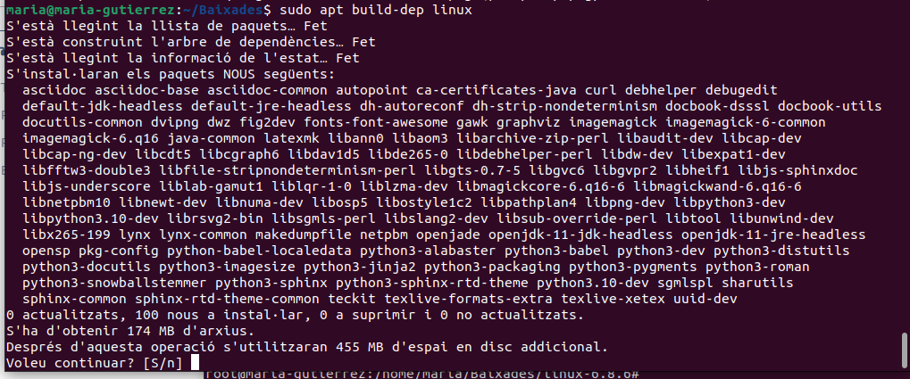

## Part 2 - Crear patch
Aquesta part consisteix a fer la modificació real al codi font. Després de canviar a l'usuari root (sudo su) i navegar al directori del kernel descarregat (cd linux-6.8.6)21, el que vaig fer va ser:

1. Copiar l'arxiu original que volia modificar: cp init/main.c init/main.c.copia22.    
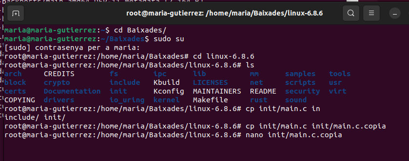

3. Modificar la còpia (init/main.c.copia). En l'arxiu, concretament a la funció start_kernel(void), vaig afegir la línia pr_notice("Hola, Maria!"), a la línia 897. Aquesta funció fa que es mostri un missatge al log del sistema quan el kernel arrenca.    
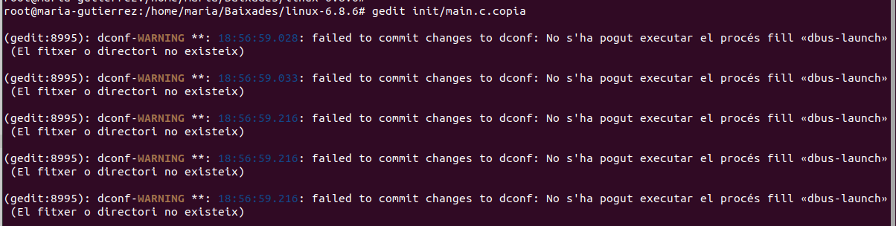
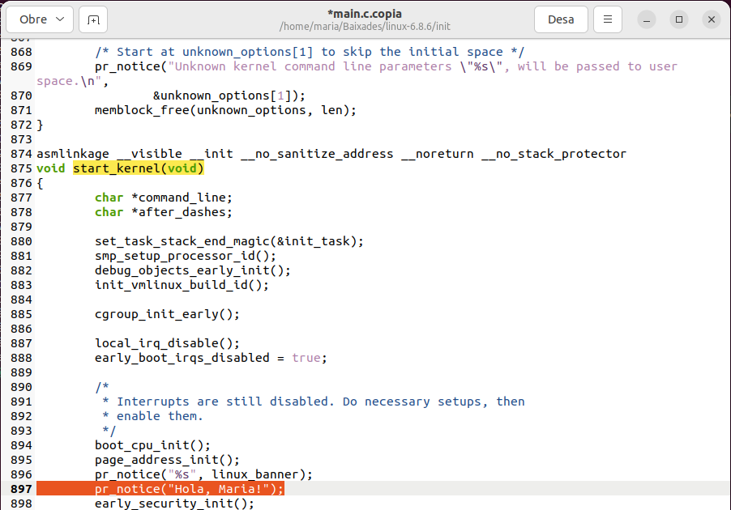

5. Crear el "patch": Vaig utilitzar la comanda diff -u init/main.c init/main.c.copia > parche-maria.patch. Aquesta comanda compara l'arxiu original (init/main.c) amb la versió modificada (init/main.c.copia) i guarda les diferències en un arxiu anomenat parche-maria.patch. Aquest fitxer conté només les línies de codi que s'han d'afegir, treure o canviar.      
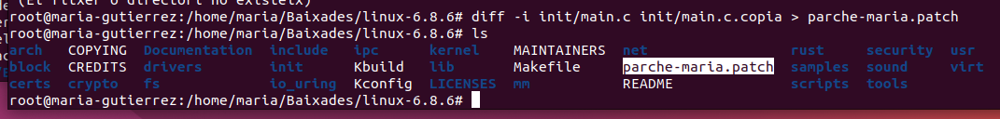
   
7. Aplicar el "patch": Amb la comanda patch -p0 < parche-maria.patch, vaig aplicar les modificacions al fitxer original (init/main.c). Finalment, amb grep "Hola" init/main.c, vaig confirmar que la línia pr_notice("Hola, Maria!"); s'havia afegit correctament a l'arxiu original init/main.c.    
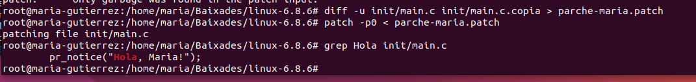

## Part 3 - Compilar kernel
Amb el codi modificat, el pas següent va ser preparar i iniciar la compilació.

1. Primer de tot, vaig copiar l'arxiu de configuració de l'antic kernel per tenir una base de configuració coneguda. L'arxiu copiat es diu .config i prové del kernel que estava actiu (config-6.8.0-87-generic).    
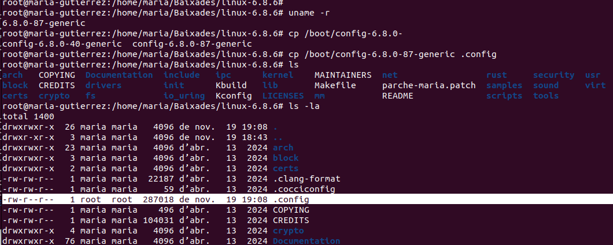

3. A continuació, vaig executar make oldconfig. Aquesta comanda utilitza el fitxer .config copiat com a base i només pregunta per les noves opcions que es troben a la versió 6.8.6 que no estaven a la 6.8.0.    
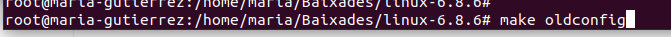
   
5. Després, vaig editar l'arxiu .config per fer certes modificacions importants:
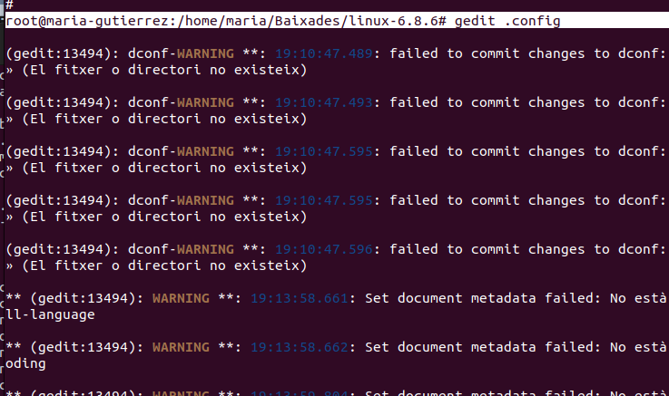

   3.1. Signatura de mòduls: Vaig eliminar els valors dels certificats CONFIG_SYSTEM_TRUSTED_KEYS i CONFIG_SYSTEM_REVOCATION_KEYS. Això es fa sovint per evitar problemes amb les claus de Canonical (Ubuntu) quan es compila un kernel personalitzat.      
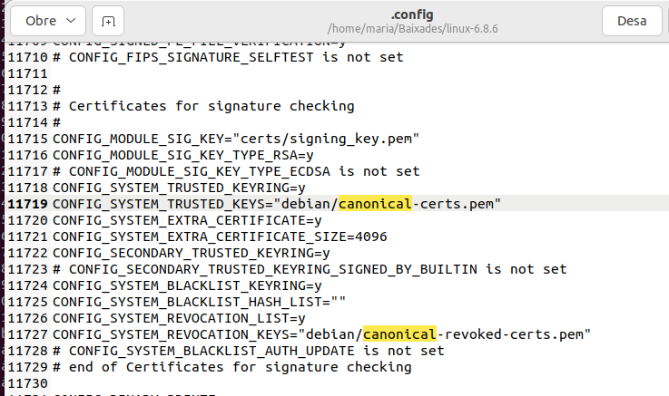
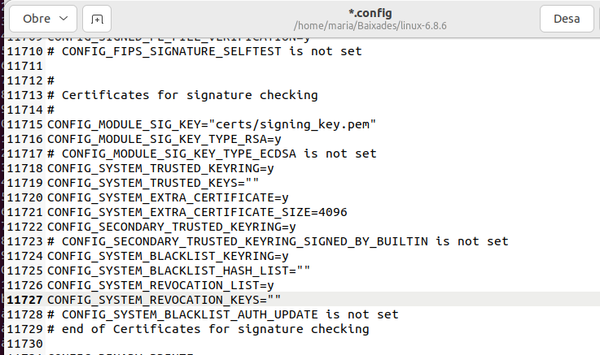

   3.2. Informació de depuració (Debug Info): Es van fer diversos canvis relacionats amb la depuració (Debug). La configuració de depuració es va canviar per deshabilitar la informació de depuració detallada. Es va establir CONFIG_DEBUG_INFO=n i CONFIG_DEBUG_INFO_BTF_MODULES=n, ja que mantenir aquestes opcions activades fa que el kernel sigui molt més gran i la compilació molt més lenta.      
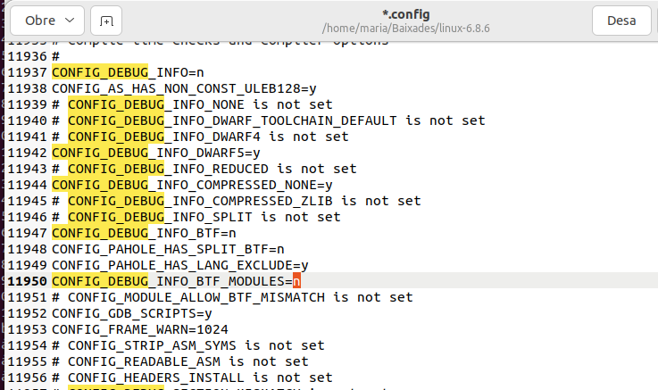

7. Tot seguit, amb el fitxer .config finalitzat, vaig utilitzar la comanda make-kpkg per compilar i generar els paquets .deb d'instal·lació del kernel de forma simplificada. Aquesta comanda genera l'imatge del kernel (kernel_image), els fitxers de capçaleres (kernel_headers) i inclou el sistema de fitxers inicial initrd. El procés de compilació és llarg i intensiu en recursos.     

make-kpkg --initrd kernel_image kernel_headers exec make kpkg_version=13.018+nmu2 -f /usr/share/kernel-package/ruleset/minimal.mk debian INITRD=YES. 

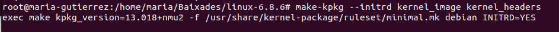

## Part 4 - Comprovacions

L'última fase va ser instal·lar i provar el nou kernel.

1. Després de la compilació, a la carpeta ~/Baixades, es van generar els dos paquets .deb del nou kernel:

   * linux-headers-6.8.6-10.00.Custom_amd64.deb

   * linux-image-6.8.6-10.00.Custom_amd64.deb

2. A continuació, vaig instal·lar-los utilitzant sudo dpkg -i... . Un cop instal·lat el nou kernel, vaig fer un sudo apt -f install addicional, que va indicar que alguns paquets de l'antic kernel (6.8.0-40-generic) ja no eren necessaris.    
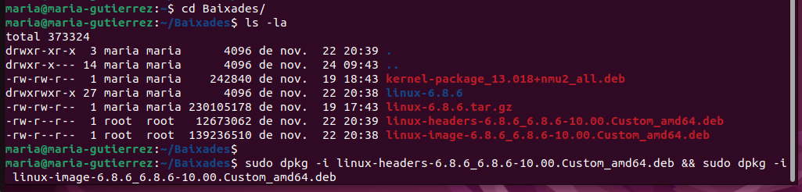
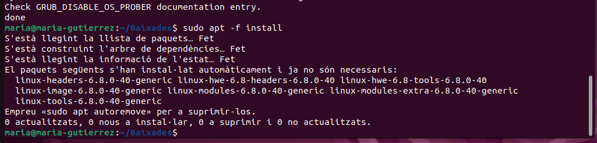

4. Després d'instal·lar el nou kernel, cal actualitzar el GRUB. Vaig modificar l'arxiu /etc/default/grub, comentant les linies de "GRUB_TIMEOUT" i, posteriorment, vaig executar sudo update-grub. Aquesta comanda reconeix les noves imatges del kernel i les afegeix al menú d'arrencada del sistema. Es pot veure clarament com reconeix l'vmlinuz-6.8.6 i el seu initrd.img.    
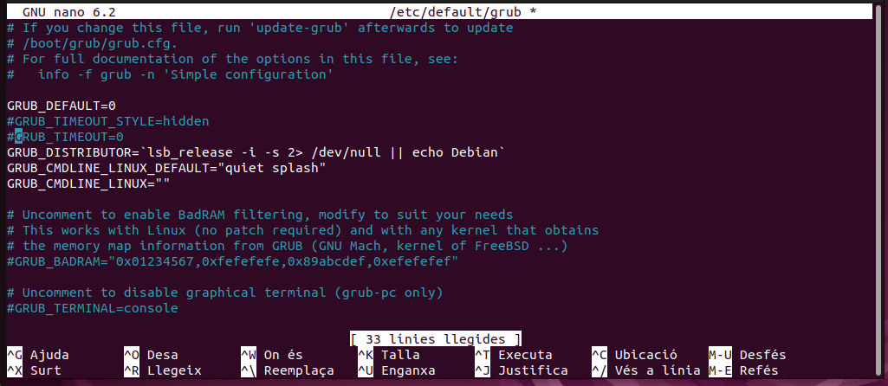
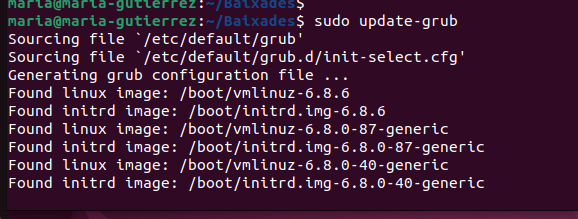

6. Finalment, vaig reiniciar la màquina virtual o l'ordinador. Al menú GRUB, es pot veure la nova entrada: "Ubuntu, with Linux 6.8.6", cosa que confirmava que el nou kernel es podia arrencar.      
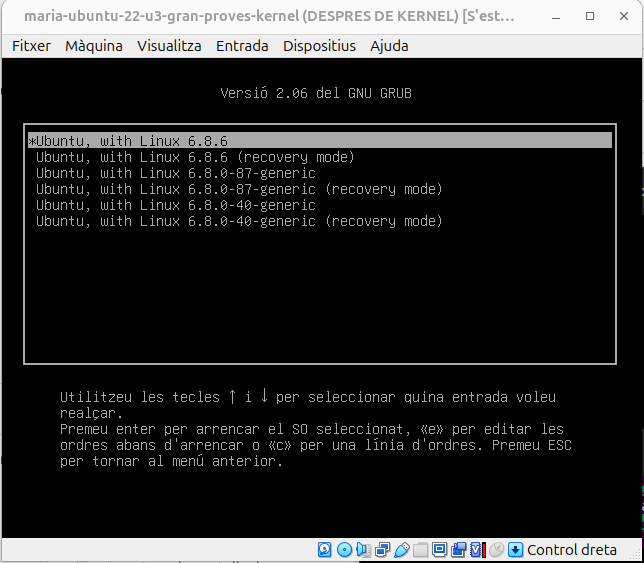

7. Per comprovar la modificació que es va fer al init/main.c, un cop arrencat el nou kernel 6.8.6, vaig utilitzar la comanda: cat /var/log/syslog | grep "Hola". El resultat, Hola, Maria!, a l'inici del log del kernel  demostra que el kernel modificat es va compilar, instal·lar i arrencar correctament, executant el codi personalitzat que es va afegir.    
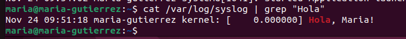
