1. Abans d'instal·lar qualsevol component, és fonamental actualitzar la llista de paquets disponibles i les versions dels paquets ja instal·lats per garantir la seguretat i estabilitat del servidor.
```bash
# Actualitzar la llista de paquets
sudo apt-get update

# Actualitzar els paquets instal·lats
sudo apt-get upgrade -y
``` 
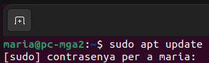
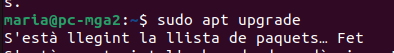

2. Instal·larem el paquet 'apache2', que inclou el servidor web i les eines necessàries per al seu funcionament. Després de la instal·lació, iniciarem el servei per posar en marxa el servidor web.
```bash
# Instal·lar el servidor web Apache2
sudo apt-get install apache2 -y

# Iniciar el servei d'Apache
sudo systemctl start apache2
```
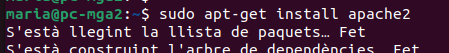
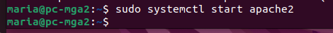

3. És crucial verificar que el servidor web Apache s'estigui executant correctament i habilitar-lo perquè s'iniciï automàticament cada vegada que s'iniciï el servidor.
```bash
# Verificar l'estat del servei Apache
sudo systemctl status apache2

# Habilitar Apache per iniciar automàticament
sudo systemctl enable apache2
```
4. En aquest pas, instal·larem el servidor de bases de dades MariaDB, que és una alternativa compatible i de codi obert a MySQL, clau per emmagatzemar la informació de les nostres aplicacions.
```bash
# Instal·lar el servidor de base de dades MariaDB
sudo apt install mariadb-server -y
```
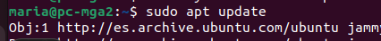
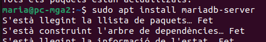

5. Un cop instal·lat MariaDB, iniciarem el servei i executarem l'script de seguretat vital per eliminar configuracions insegures per defecte, com usuaris anònims o l'accés remot de root, i establirem una contrasenya per al root de la base de dades.
```bash
# Iniciar el servei de MariaDB
sudo systemctl start mariadb

# Executar l'script de configuració segura
sudo mysql_secure_installation

# Habilitar MariaDB per iniciar automàticament amb el sistema
sudo systemctl enable mariadb
```
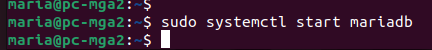
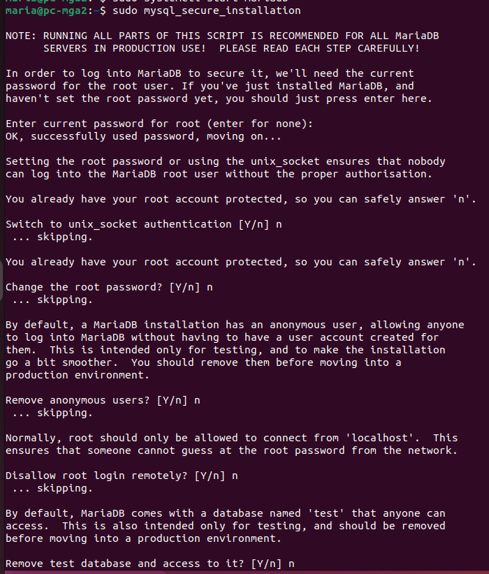
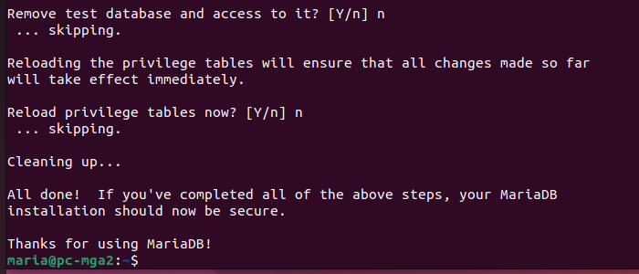
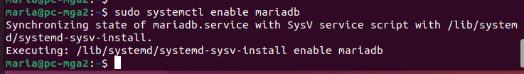

6. Per augmentar la seguretat, evitarem utilitzar l'usuari 'root' per a les aplicacions web diàries. Accedirem a la consola de MariaDB per crear un nou usuari específic amb la seva corresponent contrasenya segura.
```bash
# Accedir al client de MariaDB
sudo mariadb

# Crear el nou usuari amb contrasenya
CREATE USER 'maria'@'localhost' IDENTIFIED BY 'maria';

# Sortir de la consola
exit
```
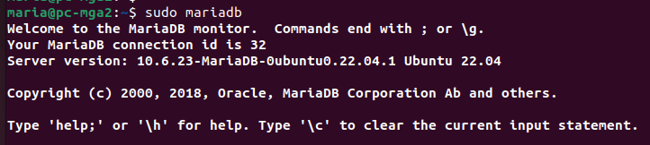
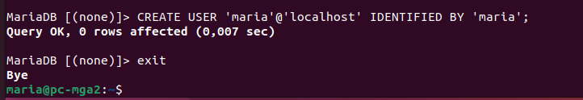

7. Instal·larem PHP juntament amb una àmplia selecció d'extensions essencials per al funcionament dinàmic de les aplicacions web, incloent connectors per a bases de dades, gestió de fitxers i processament d'imatges.
```bash
# Instal·lar PHP i les extensions necessàries
sudo apt install -y php php-tcpdf php-cgi php-pear php-mbstring libapache2-mod-php php-common php-phpseclib php-mysql php-mbstring php-zip php-gd php-json php-curl
```
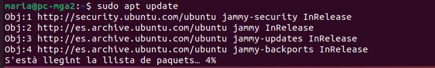
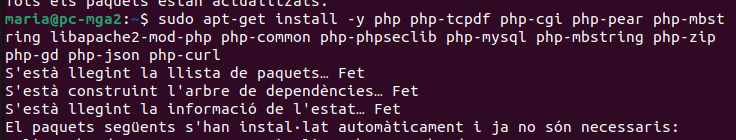

8. Instal·larem phpMyAdmin, una eina gràfica basada en web que facilita enormement la gestió de les bases de dades MariaDB des del navegador. Aquí haurem de seleccionar apache2 i configurar una contrasenya. 
```bash
# Instal·lar phpMyAdmin
sudo apt install phpmyadmin -y
```
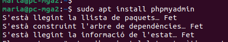
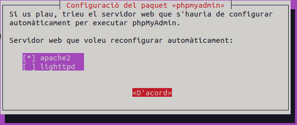
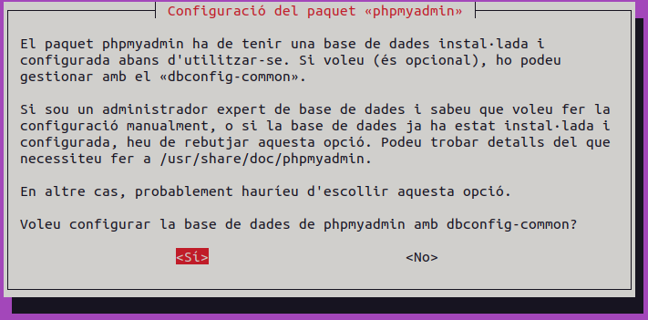
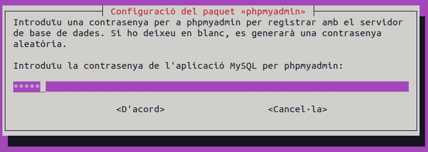
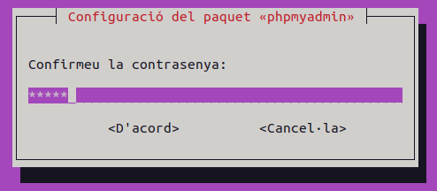

9. Habilitarem l'extensió 'mbstring' de PHP, necessària per al funcionament de phpMyAdmin, i reiniciarem el servidor web Apache per aplicar totes les configuracions.
```bash
# Habilitar l'extensió mbstring
sudo phpenmod mbstring

# Reiniciar el servei d'Apache
sudo systemctl restart apache2
```
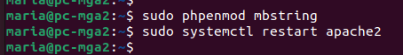

11. Configurarem el directori del projecte i assignarem permisos de l'usuari local per gestionar els fitxers sense `sudo`.
```bash
# Ir al directorio raíz de Apache
cd /var/www/html

# Crear carpeta del proyecto
sudo mkdir -p php-projects

# Dar permisos a tu usuario
sudo chown -R $USER:$USER php-projects

# Crear archivo PHP de prueba
nano php-projects/index.php
```
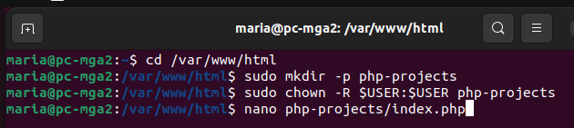
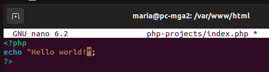

12. Mapejarem el nom del teu domini local a la IP de la teva màquina (127.0.0.1) per accedir directament des del navegador.
```bash
# Editar el archivo hosts
sudo nano /etc/hosts
```
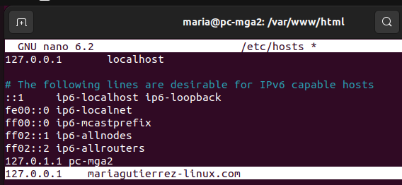

13. Generarem un certificat autofirmat per habilitar HTTPS en l'entorn local.
```bash
# Crear carpeta para certificados
sudo mkdir -p /etc/apache2/ssl
cd /etc/apache2/ssl

# Crear certificado autofirmado de 1 año
sudo openssl req -x509 -nodes -days 365 -newkey rsa:2048 \
  -keyout mariagutierrez-linux.key \
  -out mariagutierrez-linux.crt
```
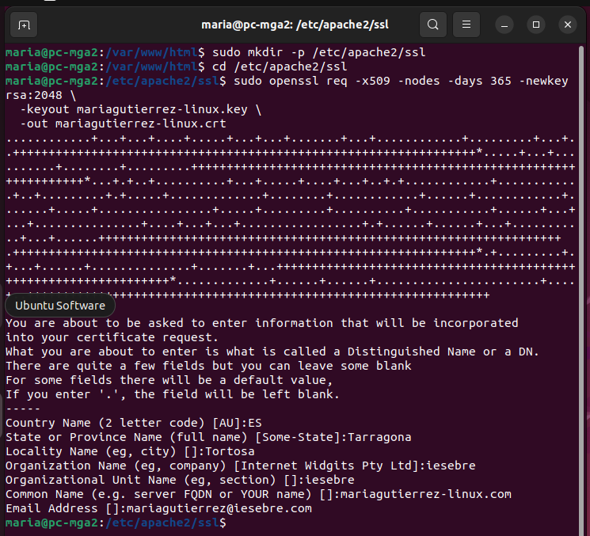

14. Crearem el fitxer de configuració per gestionar el teu domini, tant per HTTP (port 80) com per HTTPS (port 443).
```bash
# Crear archivo de configuración del VirtualHost
sudo nano /etc/apache2/sites-available/mariagutierrez-linux.com.conf
```
```bash
<VirtualHost *:80>
    ServerName mariagutierrez-linux.com
    DocumentRoot /var/www/html/php-projects

    <Directory /var/www/html/php-projects>
        Options Indexes FollowSymLinks
        AllowOverride All
        Require all granted
    </Directory>
</VirtualHost>

<VirtualHost *:443>
    ServerName mariagutierrez-linux.com
    DocumentRoot /var/www/html/php-projects

    SSLEngine on
    SSLCertificateFile /etc/apache2/ssl/mariagutierrez-linux.crt
    SSLCertificateKeyFile /etc/apache2/ssl/mariagutierrez-linux.key

    <Directory /var/www/html/php-projects>
        Options Indexes FollowSymLinks
        AllowOverride All
        Require all granted
    </Directory>
</VirtualHost>
```
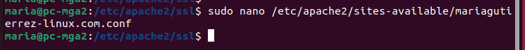
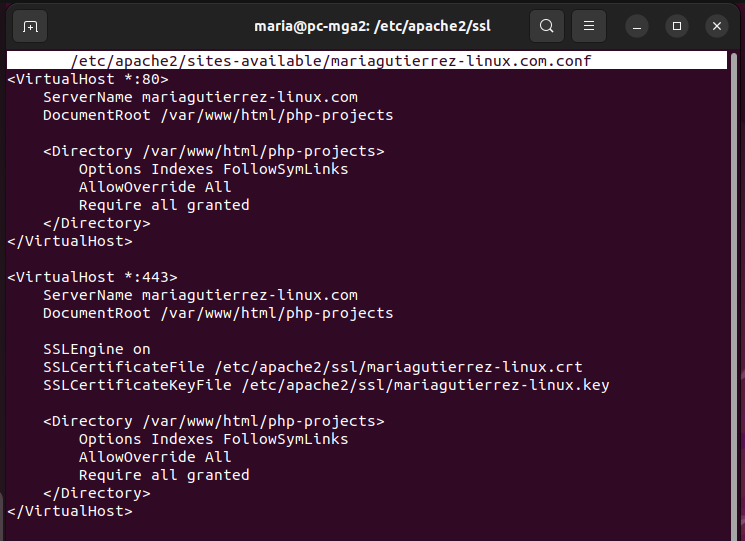

15. Activarem el mòdul SSL i el nou lloc web, deshabilitant el lloc per defecte per evitar conflictes. Aplicarem els canvis realitzats en la configuració del servidor.
```bash
# Habilitar módulo SSL
sudo a2enmod ssl

# Habilitar el nuevo sitio
sudo a2ensite mariagutierrez-linux.com.conf

# Reiniciar Apache
sudo systemctl restart apache2
```
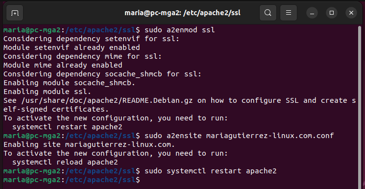

16. Ara que el servidor està configurat, verificarem el funcionament accedint des del navegador. Primer, prova amb `http://mariagutierrez-linux.com`, que hauria de mostrar la pàgina `phpinfo()` sense problemes. Després, accedeix a `https://mariagutierrez-linux.com`. En aquest segon cas, és normal que el navegador mostri un avís de seguretat dient "La teva connexió no és privada". Això passa perquè el certificat SSL l'hem creat nosaltres mateixos (autofirmat) i no està emès per una autoritat certificadora reconeguda. Haurem de fer clic a "Avançat" i després a "Continuar a..." per acceptar el risc i visualitzar el lloc web de manera segura.
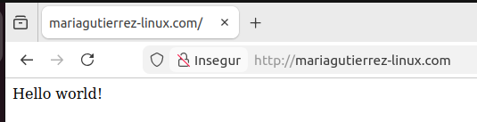
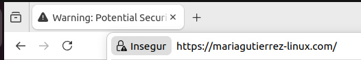
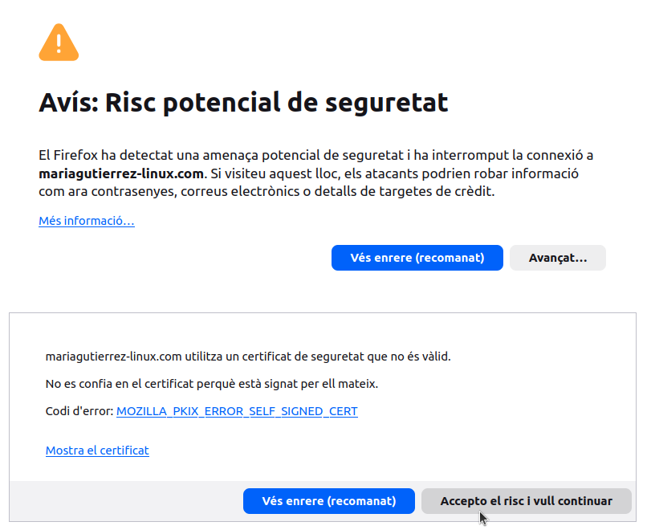
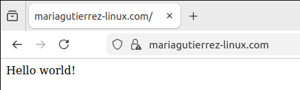

---
