## Part 1 - Preparar l'entorn
1. El primer que vaig fer va ser accedir al Moodle del centre, on hi havia penjat el material de la pràctica. En aquest apartat vaig trobar els arxius base, una guia per crear serveis en Windows, l’enllaç a la web de NSSM i el programa nssm.exe per descarregar.    
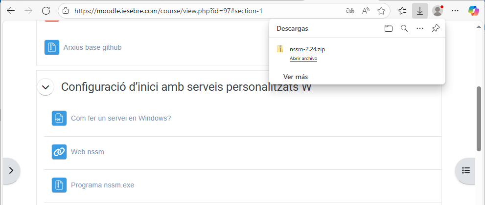

3. Un cop descarregat el fitxer nssm-2.24.zip, el vaig descomprimir. Això em va generar una carpeta amb el mateix nom, que conté l’executable necessari per crear serveis personalitzats a Windows.    
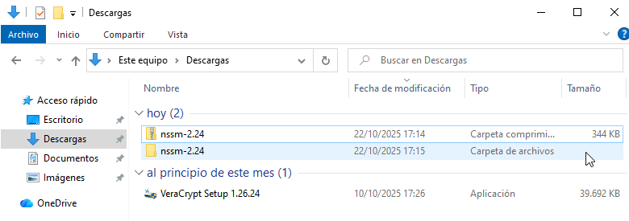

5. Tot seguit, vaig moure la carpeta nssm-2.24 al disc local C: per tenir-la accessible. Això em va permetre treballar amb el programa des de la consola amb permisos d’administrador.    
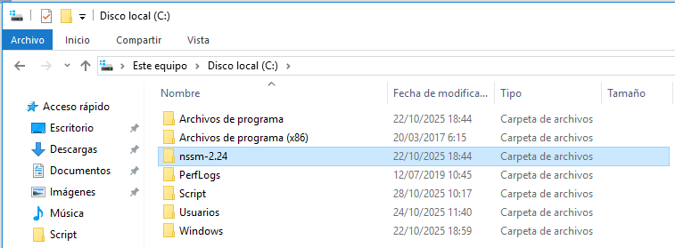

---

## Part 2 - Creació de l'script
1. Dins del disc C:, vaig crear una carpeta anomenada Script on vaig guardar el meu script de monitorització (script.ps1). Aquesta carpeta serà la que el servei executarà automàticament.    
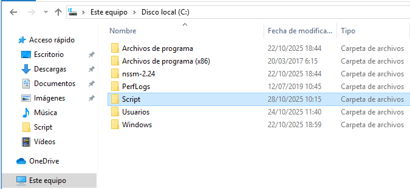

3. A la carpeta Script hi vaig crear el script '.ps1'.    
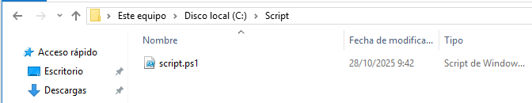

5. Perquè el sistema pogués enviar correus automàtics, vaig accedir a la configuració del meu compte de Google i vaig crear una contrasenya d’aplicació específica per al script. Això em va permetre connectar-me al servidor SMTP de Gmail de forma segura.    
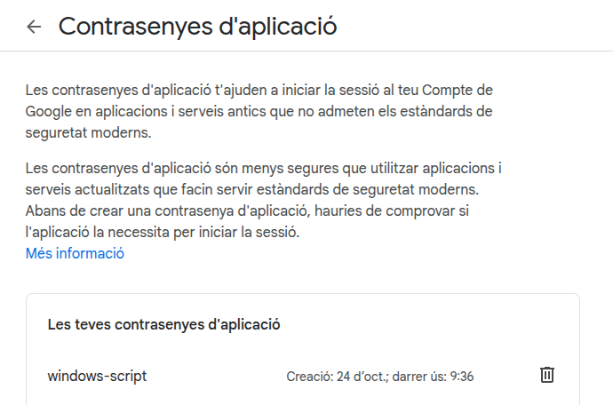

6. Aquesta primera part crea la carpeta i el fitxer de log si no existeixen, defineix quins esdeveniments del sistema, seguretat i PowerShell són sospitosos, i prepara les dades per enviar correus amb Gmail.
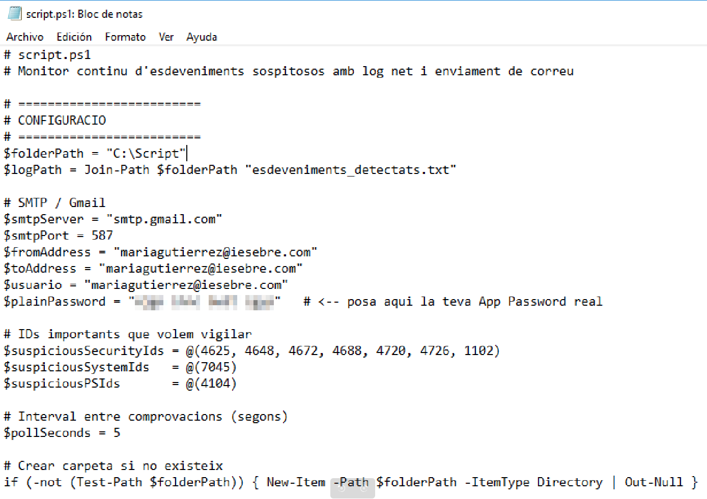

7. Segona part: cada pocs segons comprova els esdeveniments nous des de l’última execució, filtrant només els que són importants o sospitosos, evitant errors si no n’hi ha cap.
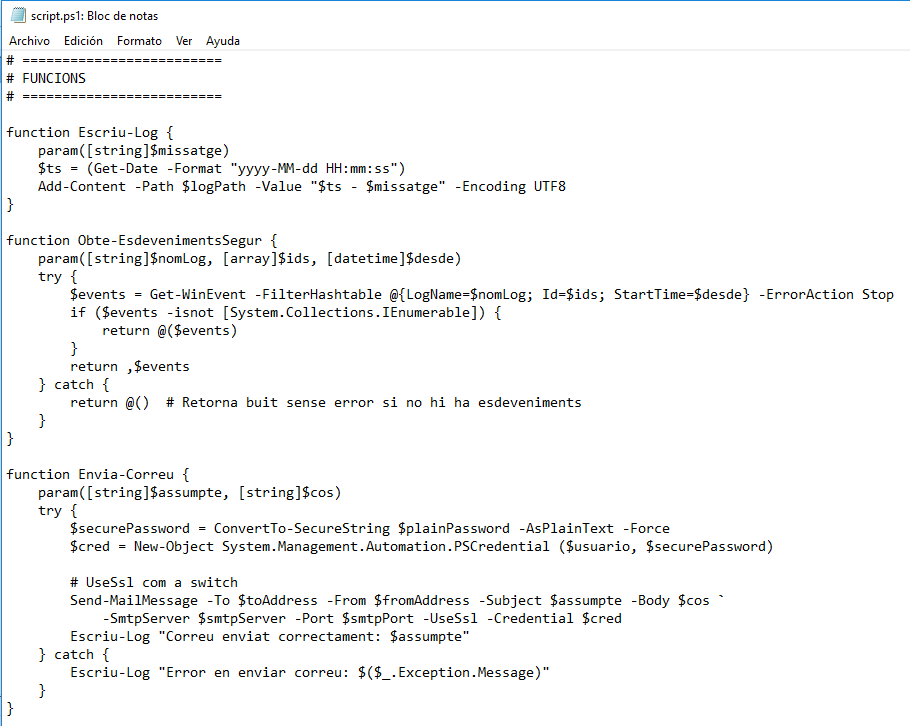

8. En la tercera i última part si es detecta algun esdeveniment rellevant, escriu la informació detallada al fitxer de log i envia un correu amb un resum i els detalls del que ha passat.
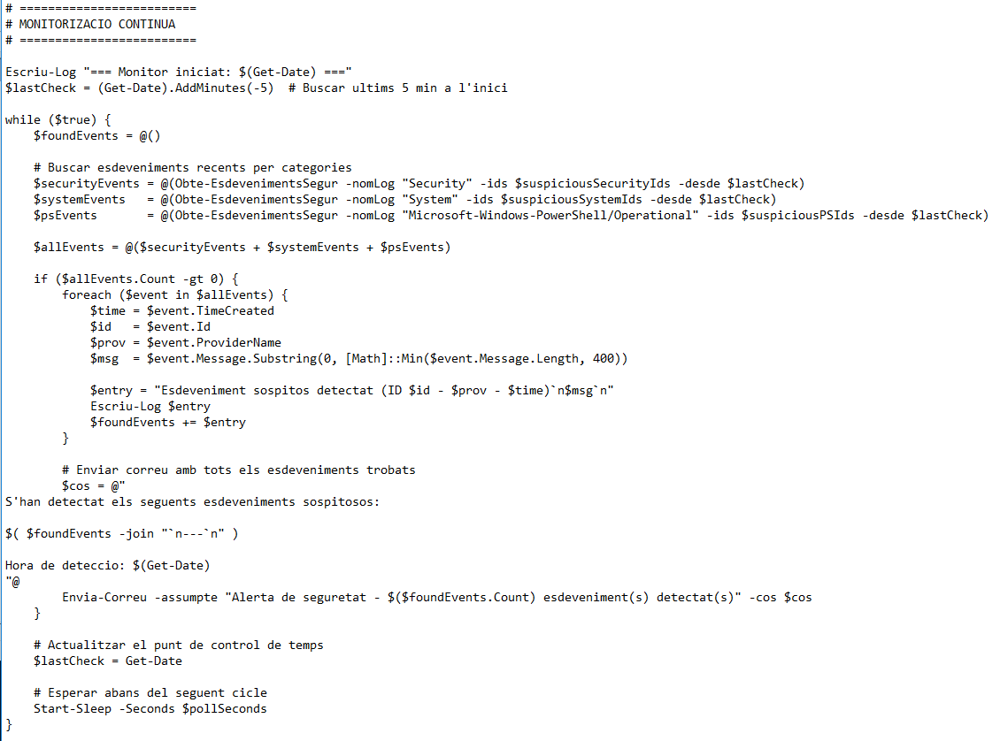


---

## Part 3 - Creació del servei
1. Des de PowerShell, vaig navegar fins a la carpeta win64 de NSSM i vaig executar el comandament per instal·lar el servei MARIA. Aquest servei s’encarregarà d’executar el meu script de forma contínua.    
```bash
.\nssm.exe install MARIA
```
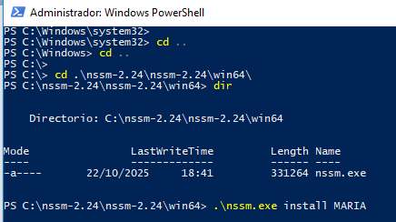

2. A la configuració del servei MARIA, vaig indicar que s’ha d’executar powershell.exe amb el script script.ps1, i vaig definir el directori d’inici com C:\Script. Això assegura que el servei s’inicia correctament amb els paràmetres adequats.      
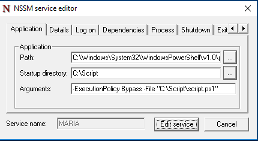

4. A la pestanya "Log on", vaig configurar el servei perquè s’executi amb el compte del sistema local i amb permís per interactuar amb l’escriptori. Aquesta opció és útil per serveis que no necessiten credencials d’usuari.    
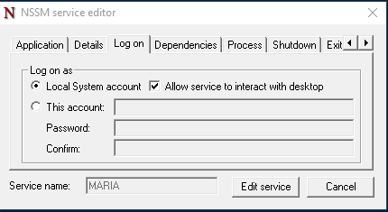

6. Un cop creat el servei, vaig obrir el gestor de serveis de Windows (services.msc) i vaig comprovar que el servei MARIA apareixia amb inici automàtic. Des d’aquí el vaig poder iniciar manualment.
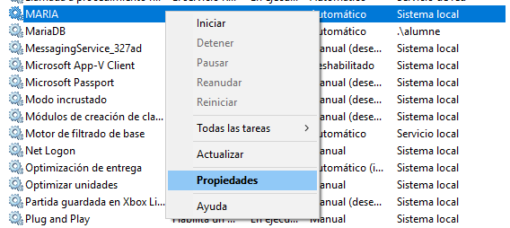

8. A les propietats del servei MARIA, vaig verificar que la ruta de l’executable era correcta (nssm.exe) i que el tipus d’inici estava configurat com automàtic. Això garanteix que el servei s’executa cada cop que s’inicia el sistema.    
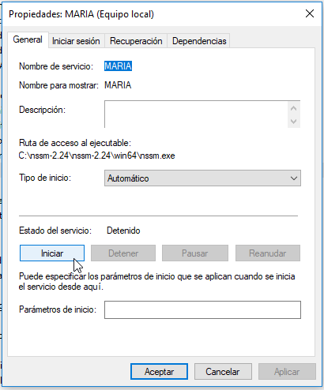

---

## Part 4 - Resultats
1. Un cop iniciat el servei, vaig comprovar que estava "En ejecución" i que funcionava sota el compte del sistema local. Això confirma que el meu script s’està executant de forma contínua com a servei.    
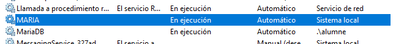

2. Per provar la detecció d’esdeveniments, vaig eliminar un usuari anomenat UsuarioPrueba des de PowerShell. Aquesta acció genera un esdeveniment de seguretat que el meu script pot detectar.
```bash
net user UsuarioPrueba /delete
```
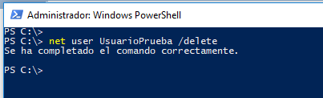

3. Després de l’eliminació, vaig revisar la carpeta Script i vaig veure que el fitxer esdeveniments_detectats.txt s’havia creat amb la informació de l’esdeveniment. Això demostra que el sistema de monitorització funciona correctament.      
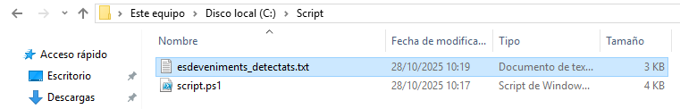

5. Dins vaig trobar l’ID 4726, que indica que s’ha eliminat un compte d’usuari. El registre inclou informació detallada del compte que ha fet l’acció i del compte eliminat.      
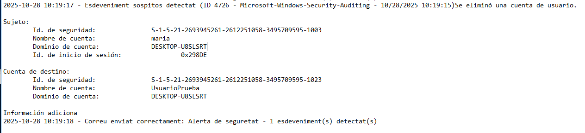

6. Poc després, vaig rebre un correu a la meva bústia de Gmail amb el títol "Alerta de seguretat - 1 esdeveniment(s) detectat(s)". Això confirma que el sistema envia notificacions automàtiques quan detecta activitat sospitosa.      
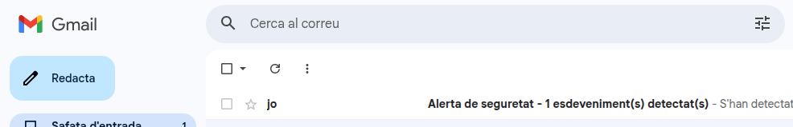

7. Finalment, vaig obrir el correu i vaig veure que contenia tota la informació de l’esdeveniment detectat: l’ID, el tipus d’acció, el compte implicat i l’hora exacta. Això demostra que el sistema és capaç de registrar i comunicar incidents de seguretat de forma eficient.      
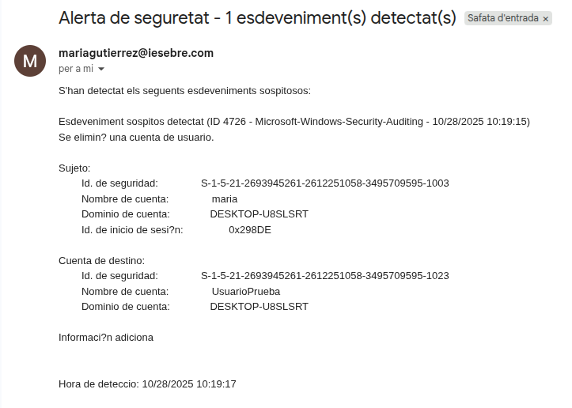

---
